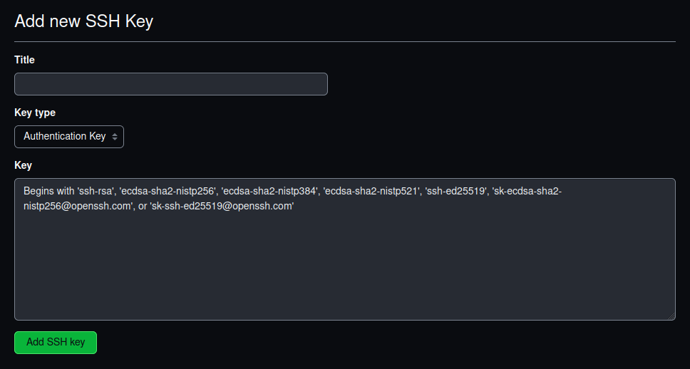

# Setting up your local development environment with Node.js and Git

## Setting up git on Linux

In your terminal type in the command that matches your linux distribution
For administrator privileges be sure to use `sudo`

### Debian/Ubuntu

For the latest stable version for your release of Debian/Ubuntu

```bash
    apt-get install git
```

For Ubuntu, this PPA provides the latest stable upstream Git version

```bash
    add-apt-repository ppa:git-core/ppa 

    apt update

    apt install git
```

### Fedora

##### (up to Fedora 21)

```bash
    yum install git
```

##### (Fedora 22 and later)

```bash
    dnf install git
```

### Gentoo

```bash
    emerge --ask --verbose dev-vcs/git
```

### Arch Linux

```bash
    pacman -S git
```

### openSUSE

```bash
    zypper install git
```

### Mageia

```bash
    urpmi git
```

### Nix/NixOS

```bash
    nix-env -i git
```

### FreeBSD

```bash
    pkg install git
```

### Solaris 9/10/11 ([OpenCSW](https://www.opencsw.org/))

```bash
    pkgutil -i git
```

### Solaris 11 Express

```bash
    pkg install developer/versioning/git
```

### OpenBSD

```bash
    pkg_add git
```

### Alpine

```bash
    apk add git
```

#### Standalone Installer


**[32-bit Git for Windows Setup](https://github.com/git-for-windows/git/releases/download/v2.45.2.windows.1/Git-2.45.2-32-bit.exe).**

**[64-bit Git for Windows Setup](https://github.com/git-for-windows/git/releases/download/v2.45.2.windows.1/Git-2.45.2-64-bit.exe).**

### Check your git installation in the terminal

```bash
    git --version
```

In your terminal enter these commands without quotes

Enter your Github user name

```bash
    git config --global user.name "Your Github User Name Here"
```

Enter the email you used to sign-up for GitHub

```bash
    git config --global user.email "your@email.com"
```

Change the name of the master branch to main (Very Important)

```bash
    git config --global init.defaultBranch main
```

Enter in terminal to see the config

```bash
    git config --list
```

The terminal should look something like this

```bash
    git config --list
    user.name=Your Github User Name Here
    user.email=your@email.com
    init.defaultbranch=main
```

# Generating an SSH key

Remain in the terminal and enter these commands

```bash
    ssh-keygen -t ed25519 -C yourgithub@email.com
```

Hit Enter until the process is done

In the terminal open the file id_ed25519.pub inside the .ssh directory within your Home directory with the following command.

```bash
    cat id_ed25519.pub
```

and copy paste the code to your github account by adding the ssh key the link here.

```url
    https://github.com/settings/keys
```

Click New ssh key button

Fill out the required fields and click the add ssh key button


Once the ssh key is added, when you try to push/create a repository a popup with ask to add your system to github fully type yes.

Enjoy being connected to github via ssh
